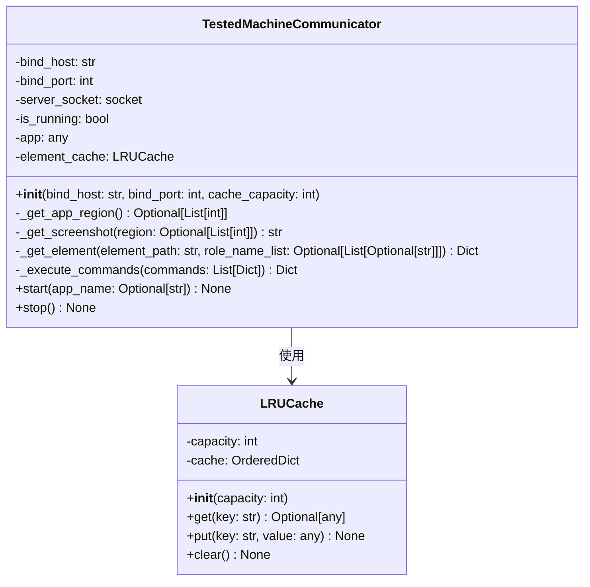
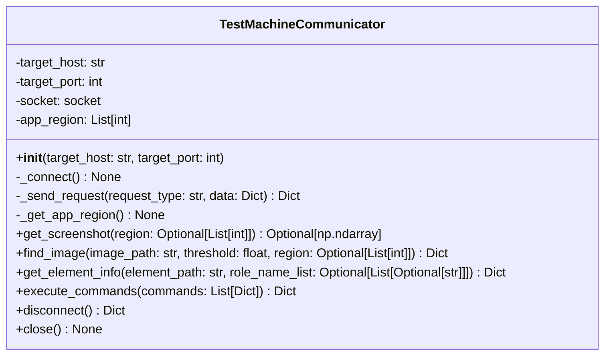
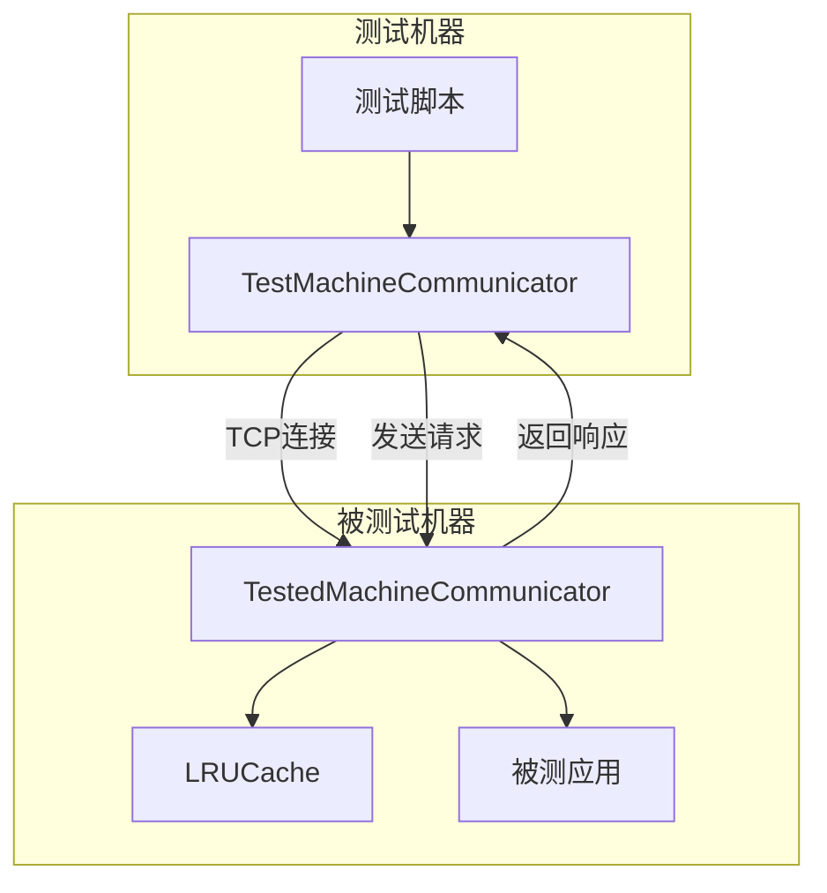

# 自动化测试通信系统类图

## 1. 被测试机器端类图

## 2. 测试机器端类图

## 3. 系统整体架构图

## 类详细说明

### 被测试机器端类

#### LRUCache 类
**职责**: 实现LRU（最近最少使用）缓存机制，用于缓存元素查询结果

**属性**:
- `capacity: int` - 缓存最大容量
- `cache: OrderedDict` - 使用OrderedDict维护元素顺序，便于实现LRU

**方法**:
- `__init__(capacity: int)` - 初始化LRU缓存
- `get(key: str) -> Optional[any]` - 获取缓存中的元素
- `put(key: str, value: any) -> None` - 添加元素到缓存
- `clear() -> None` - 清空缓存

#### TestedMachineCommunicator 类
**职责**: 被测试机器的通信类，监听8888端口并处理测试者的请求

**属性**:
- `bind_host: str` - 绑定的IP地址（0.0.0.0表示允许所有网络连接）
- `bind_port: int` - 监听的端口（默认8888）
- `server_socket: socket` - 服务器套接字
- `is_running: bool` - 服务运行状态
- `app: any` - 被测应用实例
- `element_cache: LRUCache` - 元素缓存

**私有方法**:
- `_get_app_region() -> Optional[List[int]]` - 获取被监测应用的窗口信息
- `_get_screenshot(region: Optional[List[int]]) -> str` - 截取屏幕或指定区域
- `_get_element(element_path: str, role_name_list: Optional[List[Optional[str]]]) -> Dict` - 查询元素信息
- `_execute_commands(commands: List[Dict]) -> Dict` - 执行测试者发送的指令集

**公有方法**:
- `__init__(bind_host: str, bind_port: int, cache_capacity: int)` - 初始化通信服务
- `start(app_name: Optional[str]) -> None` - 启动通信服务
- `stop() -> None` - 停止通信服务

### 测试机器端类

#### TestMachineCommunicator 类
**职责**: 测试者机器的通信类，用于向被测试机器发送请求并接收响应

**属性**:
- `target_host: str` - 目标被测试机器的IP地址
- `target_port: int` - 目标被测试机器的端口
- `socket: socket` - 客户端套接字
- `app_region: List[int]` - 应用窗口区域信息

**私有方法**:
- `_connect() -> None` - 建立与被测试机器的TCP连接
- `_send_request(request_type: str, data: Dict) -> Dict` - 发送请求并接收响应
- `_get_app_region() -> None` - 从被测试机获取应用窗口信息

**公有方法**:
- `__init__(target_host: str, target_port: int)` - 初始化通信客户端
- `get_screenshot(region: Optional[List[int]]) -> Optional[np.ndarray]` - 获取屏幕截图
- `find_image(image_path: str, threshold: float, region: Optional[List[int]]) -> Dict` - 图像识别查找
- `get_element_info(element_path: str, role_name_list: Optional[List[Optional[str]]]) -> Dict` - 获取元素信息
- `execute_commands(commands: List[Dict]) -> Dict` - 执行指令集
- `disconnect() -> Dict` - 主动断开连接
- `close() -> None` - 关闭连接

## 系统功能

### 被测试机器端功能
1. **网络通信**: 监听指定端口，处理测试者的TCP请求
2. **元素查询**: 使用dogtail库查询UI元素，支持LRU缓存优化
3. **截图功能**: 支持全屏或指定区域截图
4. **指令执行**: 执行鼠标和键盘操作指令
5. **应用监控**: 监控指定应用程序的窗口信息

### 测试机器端功能
1. **网络连接**: 建立与被测试机器的TCP连接
2. **图像识别**: 基于OpenCV的图像匹配功能
3. **元素查询**: 请求获取UI元素信息
4. **指令发送**: 发送操作指令到被测试机器
5. **截图获取**: 获取被测试机器的屏幕截图

## 设计模式

- **LRU缓存模式**: 使用OrderedDict实现最近最少使用缓存
- **客户端-服务器模式**: 测试机器作为客户端，被测试机器作为服务器
- **命令模式**: 将测试指令封装为命令对象执行
- **代理模式**: TestMachineCommunicator作为远程代理，封装网络通信细节 